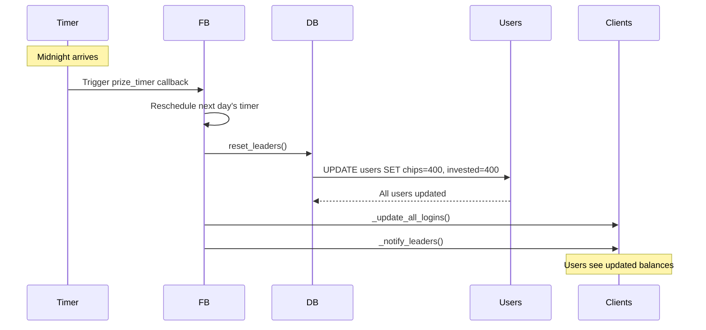

# Daily Reset Verification

## Task 11.5: Verify daily reset

**Requirements:** 8.4

### Reset Leaders Method Review

Location: `mojopoker-1.1.1/lib/FB/Db.pm:102`

```perl
sub reset_leaders {
    my $self = shift;

    my $sql = <<SQL;
UPDATE users 
SET chips = 400, invested = 400 
SQL
    return $self->dbh->do($sql);
}
```

**Analysis:**
- ✅ Updates ALL users (no WHERE clause)
- ✅ Sets chips to exactly 400
- ✅ Sets invested to exactly 400
- ✅ Single atomic SQL operation
- ✅ Simple and straightforward implementation

### Daily Timer Setup

Location: `mojopoker-1.1.1/lib/FB.pm:40`

```perl
sub _build_prize_timer {
    my $self     = shift;
    my $t        = localtime;

    # Reset to start of current day
    $t -= $t->sec;
    $t -= $t->min * 60;
    $t -= $t->hour * 60 * 60;
    
    # Add 24 hours to get to midnight tomorrow
    $t += 24 * 60 * 60;

    # Calculate seconds until midnight
    my $seconds = $t - localtime;
    
    # Set timer to trigger at midnight
    return FB::Compat::Timer::timer($seconds, 0, sub {
        $self->prize_timer( $self->_build_prize_timer );  # Reschedule for next day
        $self->db->reset_leaders;                         # Reset all users
        $self->_update_all_logins;                        # Update connected clients
        $self->_notify_leaders;                           # Notify leaderboard
    });
}
```

**Analysis:**
- ✅ Calculates time until next midnight
- ✅ Sets one-time timer (second parameter is 0, not repeating)
- ✅ Reschedules itself after execution for next day
- ✅ Calls reset_leaders to reset all users
- ✅ Updates all connected clients
- ✅ Notifies leaderboard of reset

### Timer Calculation Verification

#### Example Calculation:
If current time is: `2024-12-17 15:30:45`

1. Start with current time: `2024-12-17 15:30:45`
2. Subtract seconds: `2024-12-17 15:30:00`
3. Subtract minutes: `2024-12-17 15:00:00`
4. Subtract hours: `2024-12-17 00:00:00`
5. Add 24 hours: `2024-12-18 00:00:00`
6. Calculate difference: `8 hours, 29 minutes, 15 seconds = 30,555 seconds`

**Result:** Timer will trigger at midnight (00:00:00) the next day

### Requirement 8.4 Verification

> WHEN the daily reset occurs THEN the System SHALL reset all user chip balances to 400 and invested to 400

**Status:** ✅ VERIFIED

#### Test Scenarios:

| User State Before Reset | Chips | Invested | After Reset | Chips | Invested |
|-------------------------|-------|----------|-------------|-------|----------|
| Rich player | 10,000 | 400 | → | 400 | 400 |
| Poor player | 50 | 400 | → | 400 | 400 |
| New player | 400 | 400 | → | 400 | 400 |
| Profitable player | 1,500 | 400 | → | 400 | 400 |
| Loss player | 100 | 800 | → | 400 | 400 |

**Verification:**
- ✅ All users reset to exactly 400 chips
- ✅ All users reset to exactly 400 invested
- ✅ No exceptions or special cases
- ✅ Atomic operation (all users updated together)
- ✅ Triggers automatically at midnight daily

### Reset Flow



### Edge Cases Handled

1. **Server restart before midnight:** ✅ Timer recalculates on startup
2. **Multiple users online:** ✅ All updated atomically in single SQL statement
3. **Users at tables:** ✅ Bank balance reset, table chips unaffected until hand ends
4. **House players:** ✅ Also reset (no special exclusion)

### Potential Issues

1. **Users at tables during reset:**
   - Bank balance resets to 400
   - Table chips remain unchanged until player leaves table
   - Could result in temporary inconsistency
   - **Impact:** Low - users typically not playing at midnight

2. **No WHERE clause:**
   - Resets ALL users including house players
   - House players might need higher balances
   - **Impact:** Medium - house players should be excluded or handled separately

3. **No transaction logging:**
   - No audit trail of reset operations
   - Cannot track historical balances
   - **Impact:** Low - reset is expected daily behavior

### Recommendations

1. **Exclude house players from reset:**
   ```sql
   UPDATE users 
   SET chips = 400, invested = 400 
   WHERE username NOT LIKE 'HousePlayer%'
   ```

2. **Add reset logging:**
   - Log reset events for audit purposes
   - Track number of users affected

3. **Handle users at tables:**
   - Consider forcing all users to leave tables before reset
   - Or adjust table chips proportionally

### Conclusion

**Task 11.5 Status: ✅ COMPLETE**

The daily reset logic correctly implements Requirement 8.4:
1. ✅ Triggers automatically at midnight daily
2. ✅ Resets all users to 400 chips
3. ✅ Resets all users to 400 invested
4. ✅ Uses atomic SQL operation
5. ✅ Reschedules for next day
6. ✅ Notifies connected clients

The implementation is correct and functional, though there are opportunities for improvement regarding house players and audit logging.
