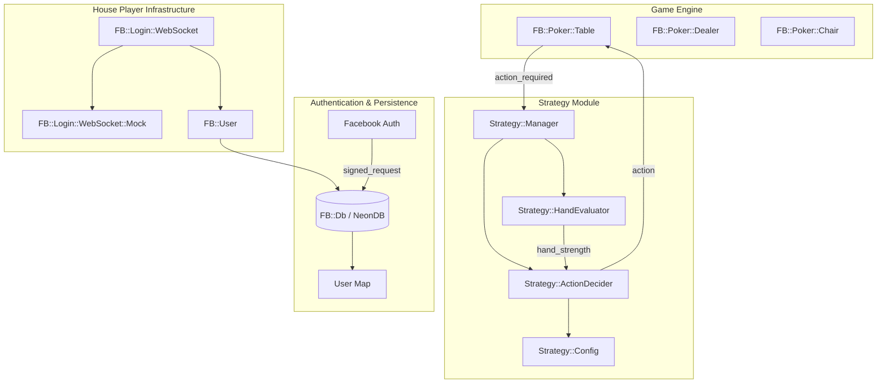
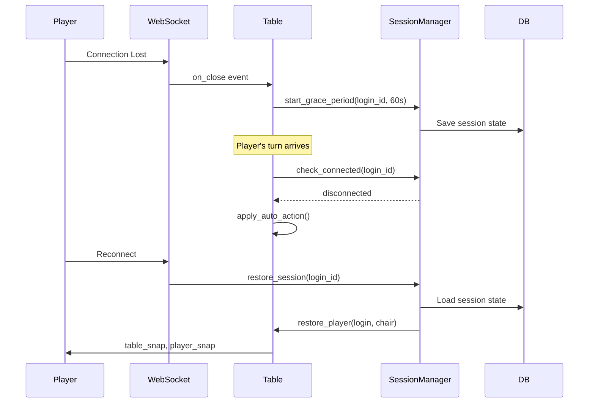

# Design Document: House Player Strategy Module

## Overview

The House Player Strategy Module provides automated decision-making capabilities for house player accounts in MojoPoker. The module evaluates poker hand strength, analyzes game state, and selects appropriate actions (bet, check, fold, draw) based on configurable strategy parameters. It integrates with the existing game engine through the same interfaces used by human players, using mock WebSocket connections for communication.

This design also documents the Facebook authentication flow and user account persistence mechanisms that enable players to maintain their accounts and chip balances across sessions.

## Architecture



## Components and Interfaces

### 1. Strategy::Manager

The central coordinator that receives game state updates and dispatches actions for house players.

```perl
package FB::Poker::Strategy::Manager;
use Moo;

has 'evaluators' => (
    is => 'ro',
    default => sub { {} },  # game_class => evaluator mapping
);

has 'config' => (
    is => 'rw',
    isa => sub { die unless $_[0]->isa('FB::Poker::Strategy::Config') },
);

# Main entry point - called when house player's turn arrives
sub decide_action {
    my ($self, $table, $chair) = @_;
    # Returns: { action => 'bet|check|fold|draw', amount => N, cards => [] }
}

# Register game-specific evaluators
sub register_evaluator {
    my ($self, $game_class, $evaluator) = @_;
}
```

### 2. Strategy::HandEvaluator

Evaluates hand strength for different poker variants.

```perl
package FB::Poker::Strategy::HandEvaluator;
use Moo::Role;

requires 'evaluate_hand';      # Returns 0.0-1.0 strength score
requires 'evaluate_potential'; # Returns improvement potential
requires 'select_discards';    # For draw games

# Base implementation
sub normalize_score {
    my ($self, $raw_score, $max_score) = @_;
    return $raw_score / $max_score;  # Returns 0.0-1.0
}
```

#### Variant-Specific Evaluators

```perl
# Texas Hold'em evaluator
package FB::Poker::Strategy::Evaluator::Holdem;
use Moo;
with 'FB::Poker::Strategy::HandEvaluator';

sub evaluate_hand {
    my ($self, $hole_cards, $community_cards) = @_;
    # Uses FB::Poker::Eval for 7-card evaluation
    # Returns normalized strength 0.0-1.0
}

# Omaha evaluator  
package FB::Poker::Strategy::Evaluator::Omaha;
use Moo;
with 'FB::Poker::Strategy::HandEvaluator';

sub evaluate_hand {
    my ($self, $hole_cards, $community_cards) = @_;
    # Must use exactly 2 of 4 hole cards + 3 community cards
    # Evaluates all valid combinations
}

# Draw poker evaluator
package FB::Poker::Strategy::Evaluator::Draw;
use Moo;
with 'FB::Poker::Strategy::HandEvaluator';

sub select_discards {
    my ($self, $hand) = @_;
    # Returns array of card indices to discard
}
```

### 3. Strategy::ActionDecider

Determines the optimal action based on hand strength and game state.

```perl
package FB::Poker::Strategy::ActionDecider;
use Moo;

has 'config' => ( is => 'rw' );
has 'rng' => ( is => 'ro', default => sub { ... } );

sub decide {
    my ($self, $hand_strength, $game_state) = @_;
    
    # game_state includes:
    # - pot_size
    # - call_amount  
    # - position
    # - betting_round
    # - valid_actions
    # - min_bet, max_bet
    
    # Returns action hash
}

sub calculate_bet_amount {
    my ($self, $strength, $pot, $min, $max) = @_;
}

sub should_bluff {
    my ($self, $pot_odds) = @_;
    # Returns boolean based on bluff probability
}
```

### 4. Strategy::Config

Configuration management for strategy parameters.

```perl
package FB::Poker::Strategy::Config;
use Moo;

has 'aggression' => (
    is => 'rw',
    default => sub { 5 },  # 1-10 scale
    isa => sub { die unless $_[0] >= 1 && $_[0] <= 10 },
);

has 'tightness' => (
    is => 'rw', 
    default => sub { 5 },  # 1-10 scale
    isa => sub { die unless $_[0] >= 1 && $_[0] <= 10 },
);

has 'bluff_frequency' => (
    is => 'rw',
    default => sub { 0.10 },  # 5-15% range
    isa => sub { die unless $_[0] >= 0.05 && $_[0] <= 0.15 },
);

has 'randomization_factor' => (
    is => 'rw',
    default => sub { 0.15 },  # ±15%
);

has 'slow_play_threshold' => (
    is => 'rw',
    default => sub { 0.85 },  # Hand strength to consider slow-playing
);

sub validate {
    my ($self) = @_;
    # Returns 1 if valid, 0 otherwise
}
```

### 5. Facebook Authentication Flow

```perl
# In FB.pm - authorize method
sub authorize {
    my ($self, $login, $opts) = @_;
    
    # 1. Extract signed request
    my ($encoded_sig, $payload) = split(/\./, $opts->{authResponse}{signedRequest}, 2);
    
    # 2. Verify HMAC-SHA256 signature
    my $expected_sig = encode_base64(hmac_sha256($payload, $self->facebook_secret), "");
    return unless signatures_match($encoded_sig, $expected_sig);
    
    # 3. Decode payload to get facebook_id
    my $data = decode_json(decode_base64($payload));
    my $facebook_id = $data->{user_id};
    
    # 4. Fetch or create user
    my $user = $self->db->fetch_user({ facebook_id => $facebook_id });
    
    if ($user) {
        # Existing user - login
        $login->user($user);
        $self->_login($login);
    } else {
        # New user - register with 400 chips
        $self->register($login, { 
            facebook_id => $facebook_id,
            username => $facebook_id 
        });
    }
}
```

### 6. User Persistence (FB::Db)

```perl
# Key database operations for user persistence

sub new_user {
    my ($self, $opts) = @_;
    # INSERT into users table
    # Generate bookmark = hmac_sha1_hex(user_id, secret)
    # Set initial chips = 400, invested = 400
    # Return FB::User object
}

sub fetch_user {
    my ($self, $opts) = @_;
    # SELECT from users WHERE facebook_id = ? OR bookmark = ?
    # Return FB::User object with all fields
}

sub update_user {
    my ($self, $opts, $id) = @_;
    # UPDATE users SET chips, last_visit, etc WHERE id = ?
}

sub fetch_chips {
    my ($self, $user_id) = @_;
    # SELECT chips FROM users WHERE id = ?
}

sub credit_chips / debit_chips {
    # Atomic chip balance updates
}
```

## Data Models

### Hand Strength Score

```perl
{
    raw_score => 12345,        # From FB::Poker::Eval
    normalized => 0.75,        # 0.0-1.0 scale
    hand_rank => 'two_pair',   # Human-readable rank
    potential => 0.15,         # Improvement potential (draws)
    outs => 8,                 # Number of outs for draws
}
```

### Game State

```perl
{
    table_id => 1,
    game_class => 'holdem',
    betting_round => 2,        # 1=preflop, 2=flop, etc.
    pot_size => 150,
    call_amount => 20,
    min_bet => 2,
    max_bet => 200,
    position => 'button',      # button, sb, bb, early, middle, late
    players_in_hand => 4,
    valid_actions => ['bet', 'check', 'fold'],
    community_cards => ['Ah', 'Kd', '7c'],
    hole_cards => ['As', 'Ks'],
}
```

### Strategy Decision

```perl
{
    action => 'bet',           # bet, check, fold, call, raise, draw
    amount => 50,              # For bet/raise actions
    cards => [0, 2],           # Card indices for draw actions
    reasoning => 'strong_hand', # For debugging/logging
    confidence => 0.85,        # Decision confidence
}
```

### User Record (Database)

```sql
CREATE TABLE users (
    id SERIAL PRIMARY KEY,
    facebook_id BIGINT UNIQUE,
    username VARCHAR(255),
    handle VARCHAR(255),
    password VARCHAR(255),      -- bcrypt hash for local auth
    email VARCHAR(80),
    birthday DATE,
    chips INTEGER DEFAULT 0,
    invested INTEGER DEFAULT 0,
    level SMALLINT DEFAULT 1,
    bookmark VARCHAR(40),       -- HMAC-SHA1 session token
    reg_date TIMESTAMP,
    last_visit TIMESTAMP,
    remote_address VARCHAR(15)
);
```


## Correctness Properties

*A property is a characteristic or behavior that should hold true across all valid executions of a system-essentially, a formal statement about what the system should do. Properties serve as the bridge between human-readable specifications and machine-verifiable correctness guarantees.*

Based on the acceptance criteria analysis, the following correctness properties must be verified through property-based testing:

### Property 1: Hand Strength Normalization

*For any* valid poker hand (any combination of cards), when the Strategy_Module evaluates hand strength, the returned score SHALL be a number in the range [0.0, 1.0] inclusive.

**Validates: Requirements 1.2**

### Property 2: Action Validity

*For any* game state with a defined set of valid actions, when the Strategy_Module selects an action, the returned action SHALL be a member of the valid action set for that game state.

**Validates: Requirements 1.3, 4.1, 4.2**

### Property 3: Bet Amount Bounds

*For any* game state with defined minimum and maximum bet limits, when the Strategy_Module determines a bet amount, the amount SHALL be greater than or equal to the minimum and less than or equal to the maximum.

**Validates: Requirements 1.4**

### Property 4: Game Variant Evaluator Selection

*For any* game class (holdem, omaha, draw, etc.), when a house player joins a table of that class, the Strategy_Module SHALL use the evaluator registered for that specific game class.

**Validates: Requirements 2.4**

### Property 5: Omaha Hand Composition

*For any* Omaha hand evaluation with 4 hole cards and 5 community cards, the resulting best hand SHALL use exactly 2 hole cards and exactly 3 community cards.

**Validates: Requirements 2.2**

### Property 6: Draw Discard Validity

*For any* draw poker hand, when the Strategy_Module selects cards to discard, all returned card indices SHALL be valid indices within the hand (0 to hand_size-1) with no duplicates.

**Validates: Requirements 2.3**

### Property 7: Randomization Variance

*For any* fixed game state and hand strength, when the Strategy_Module makes decisions across many iterations, the variance in decision thresholds SHALL fall within ±15% of the base threshold.

**Validates: Requirements 3.1**

### Property 8: Bluff Rate Bounds

*For any* set of weak hands (strength < 0.3) across many decisions, the proportion of bluff actions SHALL be between 5% and 15%.

**Validates: Requirements 3.3**

### Property 9: Independent RNG

*For any* two house players at the same table with identical game states, their decision sequences SHALL be statistically independent (correlation coefficient < 0.1).

**Validates: Requirements 3.4**

### Property 10: Configuration Validation

*For any* configuration update with values outside valid ranges (aggression/tightness not in 1-10, bluff_frequency not in 0.05-0.15), the Strategy_Module SHALL reject the configuration and retain previous valid settings.

**Validates: Requirements 5.4**

### Property 11: Facebook Signature Verification

*For any* signed request, the System SHALL accept the request if and only if the HMAC-SHA256 signature of the payload matches the provided signature when computed with the Facebook app secret.

**Validates: Requirements 6.1**

### Property 12: New User Initial State

*For any* new user created via Facebook authentication, the user record SHALL have chips = 400, invested = 400, and bookmark = HMAC-SHA1(user_id, secret).

**Validates: Requirements 6.2, 6.3, 6.4**

### Property 13: User Retrieval Idempotence

*For any* existing user with a given Facebook ID, repeated authentication attempts SHALL return the same user record with preserved chip balance (no duplicate accounts created).

**Validates: Requirements 7.1, 7.2**

### Property 14: Chip Balance Consistency

*For any* user at any point in time, the sum of their bank balance and all table chip stacks SHALL equal their total chips in the system.

**Validates: Requirements 8.1, 8.3**

### Property 15: Reload Correctness

*For any* user with total chips (bank + table) less than 400, after a reload operation, their total chips SHALL equal 400 and invested SHALL increase by (400 - previous_total).

**Validates: Requirements 8.2**

### Property 16: House Player Naming Convention

*For any* house player account, the username SHALL match the pattern /^HousePlayer\d+$/.

**Validates: Requirements 9.1**

### Property 17: Mock WebSocket Interface

*For any* house player login, the websocket attribute SHALL be an instance of FB::Login::WebSocket::Mock, and send() operations SHALL not transmit network data.

**Validates: Requirements 9.2, 9.3**

### Property 18: Grace Period Session Preservation

*For any* player who disconnects while seated at a table, if they reconnect within the grace period, their seat position and chip stack SHALL be identical to their state at disconnection.

**Validates: Requirements 10.1, 10.2**

### Property 19: Auto-Action Correctness

*For any* disconnected player whose turn arrives, the auto-action taken SHALL match their configured preference: fold always folds, check_fold checks when call_amount is 0 and folds otherwise, call_N calls when call_amount <= N and folds otherwise.

**Validates: Requirements 10.3, 11.1, 11.2, 11.3**

### Property 20: Grace Period Expiration

*For any* player who remains disconnected beyond the grace period, their hand SHALL be folded (if in hand) and their seat SHALL be marked as standing up.

**Validates: Requirements 10.4**

## Disconnection Handling

### Session Persistence Architecture



### Session Manager Component

```perl
package FB::Session::Manager;
use Moo;

has 'grace_period' => (
    is => 'rw',
    default => sub { 60 },  # seconds
);

has 'disconnected_sessions' => (
    is => 'rw',
    default => sub { {} },  # login_id => { timestamp, table_id, chair, chips, auto_action }
);

has 'grace_timers' => (
    is => 'rw', 
    default => sub { {} },  # login_id => timer
);

sub on_disconnect {
    my ($self, $login, $table, $chair) = @_;
    # Store session state
    # Start grace period timer
    # Mark player as disconnected (not removed)
}

sub on_reconnect {
    my ($self, $login) = @_;
    # Cancel grace timer
    # Restore session state
    # Return player to table
}

sub grace_expired {
    my ($self, $login_id) = @_;
    # Fold current hand if in hand
    # Mark seat as standing up
    # Clean up session
}
```

### Auto-Action Settings

```perl
# Player auto-action preferences stored in chair
has 'auto_action' => (
    is => 'rw',
    default => sub { 'check_fold' },  # fold, check_fold, call_N
);

has 'auto_call_limit' => (
    is => 'rw',
    default => sub { 0 },  # Max chips to auto-call
);

has 'disconnected' => (
    is => 'rw',
    default => sub { 0 },  # Boolean
);

sub apply_auto_action {
    my ($self, $table) = @_;
    
    return unless $self->disconnected;
    
    my $action = $self->auto_action;
    my $call_amt = $table->_fetch_call_amt;
    
    if ($action eq 'fold') {
        $table->fold;
    }
    elsif ($action eq 'check_fold') {
        if ($call_amt == 0) {
            $table->check;
        } else {
            $table->fold;
        }
    }
    elsif ($action =~ /^call_(\d+)$/) {
        my $limit = $1;
        if ($call_amt <= $limit) {
            $table->bet($call_amt);
        } else {
            $table->fold;
        }
    }
}
```

### Reconnection Flow

1. Player reconnects via WebSocket
2. System checks for active disconnected session by user_id
3. If session exists and grace period not expired:
   - Cancel grace timer
   - Restore login to table watch list
   - Update chair's player login reference
   - Clear disconnected flag
   - Send table_snap and player_snap
4. If grace period expired:
   - Create new session
   - Player must rejoin table manually

## Error Handling

### Strategy Module Errors

| Error Condition | Handling | Recovery |
|----------------|----------|----------|
| Hand evaluation timeout (>3s) | Log warning, return fold action | Continue game |
| Invalid game state | Log error, return check if valid else fold | Continue game |
| Evaluator not found for game class | Use default evaluator, log warning | Continue game |
| Configuration parse error | Reject config, keep previous | Log error |
| RNG initialization failure | Use system random, log warning | Continue |

### Authentication Errors

| Error Condition | Handling | Recovery |
|----------------|----------|----------|
| Invalid Facebook signature | Return error response, reject auth | Client retry |
| Database connection failure | Return error, log critical | Retry with backoff |
| Duplicate facebook_id insert | Fetch existing user instead | Continue login |
| User creation failure | Return error response | Client retry |

### Chip Management Errors

| Error Condition | Handling | Recovery |
|----------------|----------|----------|
| Insufficient chips for action | Reject action, return error | Player must reload |
| Database update failure | Rollback transaction, retry | Log and alert |
| Negative chip balance | Reject operation, log critical | Manual intervention |

## Testing Strategy

### Property-Based Testing Framework

The module will use **Test::QuickCheck** (Perl) for property-based testing, configured to run a minimum of 100 iterations per property.

### Unit Tests

Unit tests will cover:
- Individual evaluator methods for each game variant
- Configuration validation edge cases
- Action decision logic with fixed inputs
- Facebook signature verification with known test vectors
- Database operations with mock database

### Property-Based Tests

Each correctness property will have a corresponding property-based test:

```perl
# Example: Property 1 - Hand Strength Normalization
# **Feature: house-player-strategy, Property 1: Hand Strength Normalization**
sub prop_hand_strength_normalized {
    my ($hand) = @_;  # Generated random hand
    my $evaluator = FB::Poker::Strategy::Evaluator::Holdem->new;
    my $strength = $evaluator->evaluate_hand($hand->{hole}, $hand->{community});
    return $strength >= 0.0 && $strength <= 1.0;
}

# Example: Property 2 - Action Validity
# **Feature: house-player-strategy, Property 2: Action Validity**
sub prop_action_valid {
    my ($game_state) = @_;  # Generated random game state
    my $manager = FB::Poker::Strategy::Manager->new;
    my $decision = $manager->decide_action($game_state);
    return exists $game_state->{valid_actions}{$decision->{action}};
}
```

### Test Generators

Custom generators for property-based tests:

```perl
# Hand generator
sub gen_hand {
    my ($game_class) = @_;
    my $deck = FB::Poker::Deck->new;
    $deck->shuffle;
    
    if ($game_class eq 'holdem') {
        return {
            hole => [$deck->deal(2)],
            community => [$deck->deal(5)],
        };
    } elsif ($game_class eq 'omaha') {
        return {
            hole => [$deck->deal(4)],
            community => [$deck->deal(5)],
        };
    }
    # ... other variants
}

# Game state generator
sub gen_game_state {
    my $state = {
        pot_size => int(rand(1000)) + 10,
        call_amount => int(rand(100)),
        min_bet => 2,
        max_bet => int(rand(500)) + 100,
        valid_actions => random_subset(['bet', 'check', 'fold', 'call', 'raise']),
        betting_round => int(rand(4)) + 1,
    };
    return $state;
}

# Facebook signed request generator
sub gen_signed_request {
    my ($secret, $valid) = @_;
    my $payload = encode_json({ user_id => int(rand(1000000)) });
    my $encoded_payload = encode_base64($payload, "");
    
    my $sig = $valid 
        ? hmac_sha256($encoded_payload, $secret)
        : 'invalid_signature';
    
    return encode_base64($sig, "") . '.' . $encoded_payload;
}
```

### Integration Tests

Integration tests will verify:
- End-to-end house player game participation
- Facebook login flow with mock Facebook responses
- Chip persistence across login/logout cycles
- Multi-table house player management

### Test Coverage Requirements

- All correctness properties: 100% coverage with property-based tests
- Core strategy logic: >90% line coverage with unit tests
- Error handling paths: >80% coverage
- Integration scenarios: Key user journeys covered
