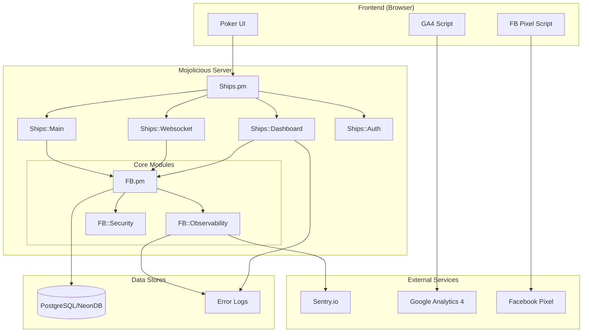

# Design Document: Observability, Dashboard & Deployment

## Overview

This design document describes the architecture and implementation for adding comprehensive observability capabilities to the MojoPoker application. The feature set includes:

1. **Sentry Integration** - Error tracking and performance monitoring
2. **GA4 Analytics** - User behavior tracking via Google Analytics 4
3. **Facebook Pixel** - Conversion tracking for marketing
4. **Admin Dashboard** - Real-time gaming metrics and system health
5. **Server Hardening** - Security headers, rate limiting, CSRF protection
6. **Fly.io Deployment** - Updated deployment procedures and documentation

The implementation follows a modular approach with a centralized `FB::Observability` module that manages all tracking integrations, and a new `Ships::Dashboard` controller for the admin interface.

## Architecture



## Components and Interfaces

### 1. FB::Observability Module

Central module for managing all observability integrations.

```perl
package FB::Observability;
use Moo;
use Mojo::JSON qw(encode_json decode_json);

# Configuration attributes
has 'sentry_dsn' => (is => 'ro', default => sub { $ENV{SENTRY_DSN} });
has 'ga4_measurement_id' => (is => 'ro', default => sub { $ENV{GA4_MEASUREMENT_ID} });
has 'fb_pixel_id' => (is => 'ro', default => sub { $ENV{FB_PIXEL_ID} });
has 'sentry_enabled' => (is => 'rw', default => 0);

# Interface methods
sub init;                    # Initialize all integrations
sub capture_error($error, $context);  # Send error to Sentry
sub get_tracking_config;     # Return config for frontend scripts
sub mask_sensitive($value);  # Mask sensitive values for logging
sub validate_config;         # Validate configuration formats
```

### 2. FB::Security Module

Handles server hardening features.

```perl
package FB::Security;
use Moo;

has 'rate_limits' => (is => 'rw', default => sub { {} });
has 'rate_limit_max' => (is => 'ro', default => 100);
has 'rate_limit_window' => (is => 'ro', default => 60);

# Interface methods
sub check_rate_limit($ip);           # Returns 1 if allowed, 0 if blocked
sub generate_csrf_token;             # Generate new CSRF token
sub validate_csrf_token($token);     # Validate submitted token
sub get_security_headers;            # Return security headers hash
sub detect_attack_patterns($request); # Check for SQL injection, XSS
sub sanitize_input($input);          # Clean potentially dangerous input
```

### 3. Ships::Dashboard Controller

Admin dashboard for viewing metrics and logs.

```perl
package Ships::Dashboard;
use Mojo::Base 'Mojolicious::Controller';

# Routes
sub index;           # GET /admin/dashboard - Main dashboard view
sub metrics;         # GET /admin/metrics - JSON metrics endpoint
sub logs;            # GET /admin/logs - Error logs view
sub logs_json;       # GET /admin/logs.json - Logs as JSON
sub health;          # GET /health - Health check endpoint
```

### 4. Ships::Auth Updates

Enhanced authentication with admin verification.

```perl
# New methods
sub is_admin($login);        # Check if user has admin privileges
sub require_admin;           # Middleware to enforce admin access
```

### 5. Template Updates

New templates and modifications:

- `templates/main.html.ep` - Add GA4 and FB Pixel scripts conditionally
- `templates/admin/dashboard.html.ep` - Admin dashboard UI
- `templates/admin/logs.html.ep` - Log viewer UI

## Data Models

### Dashboard Metrics Structure

```perl
{
    system => {
        uptime => $seconds,
        uptime_formatted => "2d 5h 30m",
        memory_usage_mb => 256,
        memory_percent => 25.5,
        cpu_percent => 15.2,
        perl_version => "5.38.0",
        mojo_version => "9.35",
    },
    gaming => {
        active_users => 42,
        active_tables => 8,
        total_chips_in_play => 125000,
        websocket_connections => 45,
        games_in_progress => 6,
    },
    tables => [
        {
            table_id => 1,
            game_type => "holdem",
            player_count => 6,
            pot_size => 2500,
            status => "active",
        },
        # ...
    ],
    timestamp => "2025-12-17T10:30:00Z",
}
```

### Error Log Entry Structure

```perl
{
    id => 12345,
    timestamp => "2025-12-17T10:30:00Z",
    severity => "error",  # debug, info, warn, error, fatal
    message => "Database connection failed",
    source => "FB::Db::connect line 45",
    user_id => 123,       # Optional
    login_id => "abc123", # Optional
    request_url => "/websocket",
    request_method => "GET",
    stack_trace => "...", # Optional
}
```

### Sentry Event Structure

```perl
{
    exception => {
        type => "DBI::Error",
        value => "Connection refused",
    },
    user => {
        id => 123,
        login_id => "abc123",
    },
    request => {
        url => "wss://mojopoker.fly.dev/websocket",
        method => "WEBSOCKET",
    },
    tags => {
        environment => "production",
        server_region => "iad",
    },
    extra => {
        table_id => 5,
        game_state => "betting",
    },
}
```

### Security Headers Configuration

```perl
{
    'X-Frame-Options' => 'SAMEORIGIN',
    'X-Content-Type-Options' => 'nosniff',
    'X-XSS-Protection' => '1; mode=block',
    'Content-Security-Policy' => "default-src 'self'; script-src 'self' 'unsafe-inline' https://www.googletagmanager.com https://connect.facebook.net https://ajax.googleapis.com; style-src 'self' 'unsafe-inline' https://code.jquery.com; img-src 'self' data: https:; connect-src 'self' wss: https://www.google-analytics.com https://www.facebook.com;",
    'Referrer-Policy' => 'strict-origin-when-cross-origin',
    'Permissions-Policy' => 'geolocation=(), microphone=(), camera=()',
}
```

## Correctness Properties

*A property is a characteristic or behavior that should hold true across all valid executions of a system-essentially, a formal statement about what the system should do. Properties serve as the bridge between human-readable specifications and machine-verifiable correctness guarantees.*

Based on the prework analysis, the following correctness properties have been identified:

### Property 1: Error Context Completeness
*For any* error captured by the Observability_Module with associated user and request context, the Sentry event SHALL contain user_id, login_id, request URL, and request method fields.
**Validates: Requirements 1.4**

### Property 2: Error Data Round-Trip
*For any* error data structure passed to the Observability_Module, serializing to JSON and deserializing back SHALL produce an equivalent data structure.
**Validates: Requirements 1.5**

### Property 3: Tracking ID Preservation
*For any* valid GA4 measurement ID or Facebook Pixel ID configured in environment variables, the rendered HTML output SHALL contain that exact ID without modification.
**Validates: Requirements 2.4, 3.4**

### Property 4: Dashboard Metrics Completeness
*For any* authenticated admin request to the dashboard endpoint, the response SHALL contain active_users, active_tables, and total_chips_in_play fields.
**Validates: Requirements 4.1**

### Property 5: Dashboard Access Control
*For any* request to the dashboard endpoint without valid admin authentication, the response SHALL have HTTP status code 401.
**Validates: Requirements 4.2**

### Property 6: Dashboard Metrics Round-Trip
*For any* dashboard metrics data structure, serializing to JSON and deserializing back SHALL produce an equivalent data structure.
**Validates: Requirements 4.5**

### Property 7: Table Info Completeness
*For any* active table in the system, the dashboard representation SHALL contain table_id, game_type, player_count, and pot_size fields.
**Validates: Requirements 4.6**

### Property 8: Security Headers Presence
*For any* HTTP response from the MojoPoker_System, the response headers SHALL include X-Frame-Options, X-Content-Type-Options, X-XSS-Protection, and Content-Security-Policy.
**Validates: Requirements 5.1**

### Property 9: CSRF Token Validation
*For any* form submission request without a valid CSRF token, the MojoPoker_System SHALL reject the request with an appropriate error response.
**Validates: Requirements 5.4**

### Property 10: Secure Cookie Flags
*For any* HTTP response that sets a session cookie, the cookie SHALL have both HttpOnly and Secure flags set.
**Validates: Requirements 5.5**

### Property 11: Attack Pattern Detection
*For any* request containing known SQL injection or XSS attack patterns, the Security module SHALL identify and reject the request.
**Validates: Requirements 5.6**

### Property 12: Configuration Defaults
*For any* missing observability environment variable, the Observability_Module SHALL use a safe default that disables the respective tracking feature.
**Validates: Requirements 7.2**

### Property 13: Configuration Validation
*For any* configuration value provided to the Observability_Module, the validation function SHALL correctly identify whether the value matches the expected format.
**Validates: Requirements 7.3**

### Property 14: Sensitive Value Masking
*For any* sensitive configuration value (DSN, measurement ID, pixel ID), the masking function SHALL output a string showing only the last 4 characters.
**Validates: Requirements 7.4**

### Property 15: Log Entry Completeness
*For any* log entry displayed in the dashboard, the entry SHALL contain timestamp, severity, message, and source fields.
**Validates: Requirements 8.2**

### Property 16: Log Severity Filtering
*For any* severity filter applied to log queries, all returned entries SHALL have a severity level matching the filter.
**Validates: Requirements 8.3**

### Property 17: Log Entry Round-Trip
*For any* log entry data structure, serializing to JSON and deserializing back SHALL produce an equivalent data structure.
**Validates: Requirements 8.4**

## Error Handling

### Sentry Integration Errors

- If Sentry initialization fails, log warning and continue without Sentry
- If Sentry event submission fails, log locally and retry once
- Never let Sentry errors crash the main application

### Dashboard Errors

- If metrics collection fails, return partial data with error indicators
- If database query times out, return cached data if available
- Return appropriate HTTP status codes (500 for server errors, 503 for unavailable)

### Security Module Errors

- If rate limit storage fails, default to allowing the request (fail open for availability)
- If CSRF validation encounters errors, reject the request (fail closed for security)
- Log all security-related errors with high severity

### Configuration Errors

- Invalid Sentry DSN format: Log warning, disable Sentry
- Invalid GA4 ID format: Log warning, omit GA4 script
- Invalid FB Pixel ID format: Log warning, omit FB Pixel script

## Testing Strategy

### Dual Testing Approach

This implementation uses both unit tests and property-based tests:

- **Unit tests** verify specific examples, edge cases, and integration points
- **Property-based tests** verify universal properties that should hold across all inputs

### Property-Based Testing Framework

The implementation will use **Test::LectroTest** for Perl property-based testing. Each property test will run a minimum of 100 iterations.

### Test Categories

#### Unit Tests
- Sentry initialization with valid/invalid DSN
- GA4 script rendering with/without measurement ID
- FB Pixel script rendering with/without pixel ID
- Dashboard authentication flow
- Rate limiter threshold behavior
- Security header presence

#### Property-Based Tests
Each correctness property (1-17) will have a corresponding property-based test:

```perl
# Example: Property 2 - Error Data Round-Trip
# **Feature: observability-dashboard-deployment, Property 2: Error Data Round-Trip**
Property {
    ##[ error_data <- Gen_ErrorData ]##
    my $json = encode_json($error_data);
    my $decoded = decode_json($json);
    return deep_eq($error_data, $decoded);
}, name => "error_data_roundtrip";
```

#### Integration Tests
- End-to-end dashboard access with authentication
- Rate limiting across multiple requests
- Security header verification on all routes

### Test File Organization

```
t/
├── observability.t           # FB::Observability unit tests
├── observability_props.t     # Property-based tests for observability
├── security.t                # FB::Security unit tests
├── security_props.t          # Property-based tests for security
├── dashboard.t               # Ships::Dashboard unit tests
├── dashboard_props.t         # Property-based tests for dashboard
└── integration/
    └── dashboard_auth.t      # Integration tests
```

### Test Annotations

All property-based tests will be annotated with:
```perl
# **Feature: observability-dashboard-deployment, Property N: Property Name**
# **Validates: Requirements X.Y**
```
