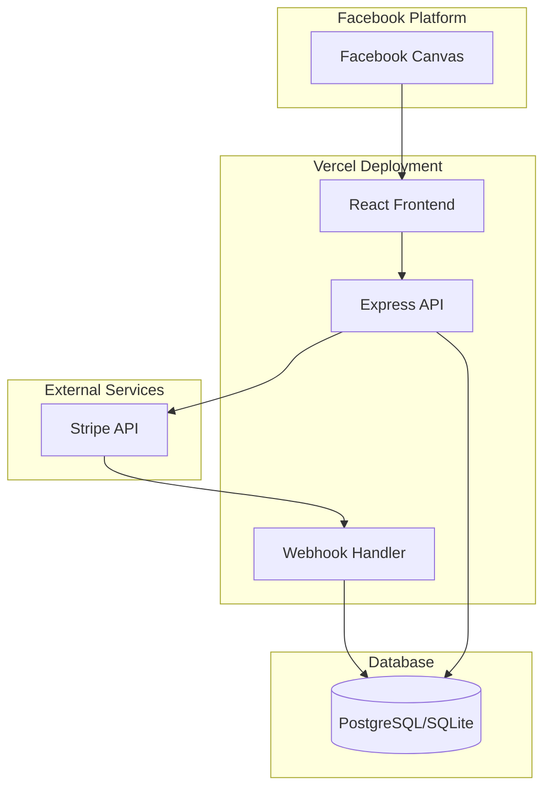

# Design Document: Stripe Chip Purchase System

## Overview

This design extends the existing Mojo Poker chip system to support Stripe payments and Facebook Canvas integration. The solution adds a Node.js payment service layer to the Vercel deployment while maintaining compatibility with the existing Perl backend's chip management.

## Architecture



## Components and Interfaces

### 1. Chip Store Component (Frontend)

Location: `vercel/public/js/chip-store.js`

```javascript
interface ChipPackage {
  id: string;
  name: string;
  chips: number;
  priceInCents: number;
  displayPrice: string;
  enabled: boolean;
}

interface ChipStoreAPI {
  getPackages(): Promise<ChipPackage[]>;
  createCheckoutSession(packageId: string): Promise<{ sessionUrl: string }>;
  getBalance(): Promise<{ chips: number }>;
  getPurchaseHistory(): Promise<Transaction[]>;
}
```

### 2. Payment Service (Backend)

Location: `vercel/lib/payment-service.js`

```javascript
interface PaymentService {
  createCheckoutSession(userId: string, packageId: string): Promise<StripeSession>;
  handleWebhook(payload: Buffer, signature: string): Promise<void>;
  getTransactionHistory(userId: string): Promise<Transaction[]>;
}
```

### 3. Daily Bonus Service

Location: `vercel/lib/daily-bonus-service.js`

```javascript
interface DailyBonusService {
  canClaimBonus(userId: string): Promise<{ canClaim: boolean; nextClaimTime?: Date }>;
  claimBonus(userId: string): Promise<{ chips: number; newBalance: number }>;
  grantWelcomeBonus(userId: string): Promise<{ chips: number }>;
}
```

### 4. Webhook Handler

Location: `vercel/api/webhooks/stripe.js`

Handles Stripe events:
- `checkout.session.completed` - Credits chips after successful payment
- `payment_intent.payment_failed` - Logs failed payments

### 5. Facebook Canvas Integration

Location: `vercel/lib/facebook-canvas.js`

```javascript
interface FacebookCanvas {
  detectContext(): { isFacebook: boolean; signedRequest?: string };
  resizeCanvas(width: number, height: number): void;
  linkFacebookUser(facebookId: string, userId: string): Promise<void>;
}
```

## Data Models

### Existing User Table (Extended)

```sql
-- Add to existing user table
ALTER TABLE user ADD COLUMN last_bonus_claim DATETIME;
ALTER TABLE user ADD COLUMN welcome_bonus_claimed BOOLEAN DEFAULT 0;
```

### New Tables

```sql
-- Chip Packages Configuration
CREATE TABLE chip_package (
    id VARCHAR(36) PRIMARY KEY,
    name VARCHAR(100) NOT NULL,
    chips INTEGER NOT NULL,
    price_cents INTEGER NOT NULL,
    enabled BOOLEAN DEFAULT 1,
    sort_order INTEGER DEFAULT 0,
    created_at DATETIME DEFAULT CURRENT_TIMESTAMP,
    updated_at DATETIME DEFAULT CURRENT_TIMESTAMP
);

-- Transaction History
CREATE TABLE chip_transaction (
    id VARCHAR(36) PRIMARY KEY,
    user_id INTEGER NOT NULL REFERENCES user(id),
    type VARCHAR(20) NOT NULL, -- 'purchase', 'daily_bonus', 'welcome_bonus', 'admin_credit'
    chips INTEGER NOT NULL,
    stripe_session_id VARCHAR(255),
    stripe_payment_intent VARCHAR(255),
    package_id VARCHAR(36) REFERENCES chip_package(id),
    created_at DATETIME DEFAULT CURRENT_TIMESTAMP,
    UNIQUE(stripe_session_id)
);

-- Processed Webhooks (Idempotency)
CREATE TABLE processed_webhook (
    event_id VARCHAR(255) PRIMARY KEY,
    event_type VARCHAR(100) NOT NULL,
    processed_at DATETIME DEFAULT CURRENT_TIMESTAMP
);
```

## Correctness Properties

*A property is a characteristic or behavior that should hold true across all valid executions of a system-essentially, a formal statement about what the system should do. Properties serve as the bridge between human-readable specifications and machine-verifiable correctness guarantees.*


### Property 1: Successful payment credits correct chip amount

*For any* completed Stripe checkout session with a valid package, the player's chip balance SHALL increase by exactly the chip amount specified in the package.

**Validates: Requirements 1.1**

### Property 2: Failed payments do not credit chips

*For any* failed Stripe payment event, the player's chip balance SHALL remain unchanged from before the payment attempt.

**Validates: Requirements 1.2**

### Property 3: Transaction records contain required fields

*For any* completed chip purchase, the transaction record SHALL contain a non-null timestamp, chip amount greater than zero, and valid Stripe payment ID.

**Validates: Requirements 1.4**

### Property 4: Purchase history returns all user transactions

*For any* user with N recorded transactions, querying their purchase history SHALL return exactly N transactions.

**Validates: Requirements 1.5**

### Property 5: Daily bonus eligibility after 24 hours

*For any* user whose last bonus claim timestamp is more than 24 hours in the past, the canClaimBonus check SHALL return true.

**Validates: Requirements 2.1**

### Property 6: Daily bonus credits fixed amount

*For any* eligible user claiming the daily bonus, their chip balance SHALL increase by exactly the configured daily bonus amount.

**Validates: Requirements 2.2**

### Property 7: Daily bonus rejected within 24 hours

*For any* user whose last bonus claim timestamp is less than 24 hours in the past, attempting to claim SHALL fail and return the remaining time until eligibility.

**Validates: Requirements 2.3**

### Property 8: Invalid webhook signatures are rejected

*For any* webhook request with a signature that does not match the HMAC-SHA256 of the payload using the Stripe signing secret, the handler SHALL return a 400 status and not process the event.

**Validates: Requirements 3.1, 3.2**

### Property 9: Webhook processing is idempotent

*For any* Stripe event ID that has been previously processed, reprocessing the same event SHALL not credit additional chips and SHALL return success.

**Validates: Requirements 3.3, 3.4**

### Property 10: Facebook user ID linkage

*For any* user authenticated via Facebook, their user record SHALL contain the Facebook user ID in the facebook_id field.

**Validates: Requirements 4.3**

### Property 11: Chip package validation

*For any* chip package configuration, the system SHALL reject packages with empty name, non-positive chip amount, or non-positive price.

**Validates: Requirements 5.2**

### Property 12: Disabled packages are not purchasable

*For any* chip package with enabled=false, the package SHALL not appear in store listings and purchase attempts SHALL fail with an error.

**Validates: Requirements 5.3**

## Error Handling

### Payment Errors

| Error Type | Handling |
|------------|----------|
| Stripe API unavailable | Return 503, display "Payment service temporarily unavailable" |
| Invalid package ID | Return 400, display "Invalid chip package selected" |
| Webhook signature invalid | Return 400, log security event, do not process |
| Duplicate webhook | Return 200 (idempotent), do not re-credit chips |
| Database error during credit | Rollback transaction, return 500, log for manual review |

### Daily Bonus Errors

| Error Type | Handling |
|------------|----------|
| Claim too early | Return 400 with `nextClaimTime` timestamp |
| User not found | Return 404, "User account not found" |
| Database error | Return 500, log error |

## Testing Strategy

### Unit Testing

- Test chip balance calculations
- Test daily bonus time calculations
- Test package validation logic
- Test webhook signature verification

### Property-Based Testing

Using **fast-check** library for JavaScript property-based testing.

Each property test will:
1. Generate random valid inputs using fast-check arbitraries
2. Execute the operation under test
3. Assert the property holds
4. Run minimum 100 iterations

Property tests will be tagged with format: `**Feature: stripe-chip-purchase, Property {number}: {property_text}**`

### Integration Testing

- End-to-end Stripe Checkout flow (using Stripe test mode)
- Webhook delivery and processing
- Facebook Canvas context detection

## API Endpoints

### Chip Store

```
GET  /api/chips/packages     - List available chip packages
GET  /api/chips/balance      - Get current user's chip balance
POST /api/chips/checkout     - Create Stripe checkout session
GET  /api/chips/history      - Get purchase history
```

### Daily Bonus

```
GET  /api/bonus/status       - Check if bonus is claimable
POST /api/bonus/claim        - Claim daily bonus
```

### Webhooks

```
POST /api/webhooks/stripe    - Stripe webhook endpoint
```

## Environment Variables

```
STRIPE_SECRET_KEY=sk_test_...
STRIPE_WEBHOOK_SECRET=whsec_...
STRIPE_PUBLISHABLE_KEY=pk_test_...
DAILY_BONUS_AMOUNT=1000
WELCOME_BONUS_AMOUNT=5000
```

## Facebook Canvas Configuration

To run as a Facebook Canvas app:

1. Create Facebook App at developers.facebook.com
2. Add "Facebook Canvas" platform
3. Set Canvas URL to your Vercel deployment URL
4. Set Secure Canvas URL (HTTPS required)
5. Configure Canvas dimensions (800x600 recommended)

The app detects Facebook context via:
- `window.parent !== window` (iframe detection)
- `fb_sig` or `signed_request` URL parameters
- Facebook JavaScript SDK initialization
